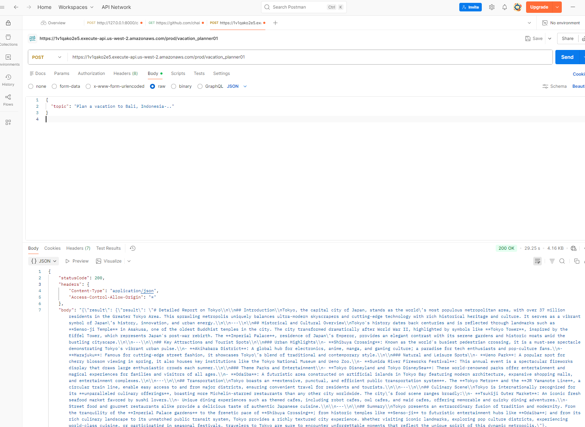
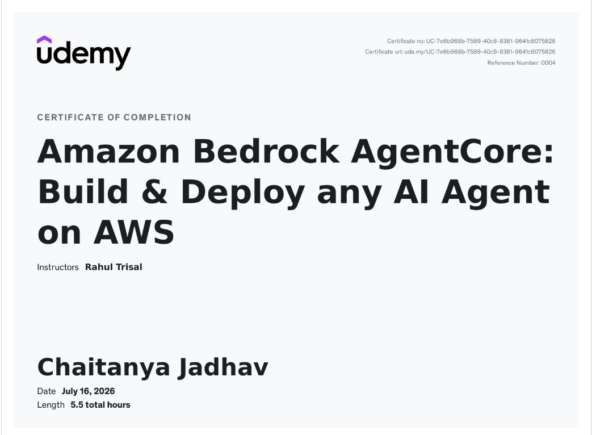

# VacationPlanner Crew — Deployed on Amazon Bedrock AgentCore

A multi-agent AI vacation planner built with [crewAI](https://crewai.com) and deployed to production on **Amazon Bedrock AgentCore Runtime**. Two agents — a *vacation researcher* and an *itinerary planner* — collaborate to research a destination and produce a detailed travel report.

This repository is primarily a **learning project for deploying any agent framework to AWS Bedrock AgentCore**: taking a locally-running CrewAI app, containerizing it for ARM64, pushing it to ECR, running it on AgentCore Runtime, and exposing it through Lambda + API Gateway with full OpenTelemetry observability.

> 🎓 Built while completing the Udemy course *Amazon Bedrock AgentCore: Build & Deploy any AI Agent on AWS*.

---

## 🚀 AWS Bedrock AgentCore Deployment (the main focus)

AgentCore Runtime is framework-agnostic: you wrap your existing agent with the AgentCore SDK, containerize it, and let AWS host it as a serverless runtime with versioned endpoints, autoscaling, and built-in observability.

### Architecture

```
Client (Postman / Streamlit UI)
        │  POST { "prompt": "..." }
        ▼
API Gateway  ──►  Lambda (invoke_agent_runtime)
                        │  payload { "topic": "..." }
                        ▼
        Bedrock AgentCore Runtime  (ARM64 container from ECR)
                        │
                        ▼
                CrewAI VacationPlanner
             (researcher → itinerary planner)
                        │
                        ▼
              Detailed vacation report (JSON)
```

### What makes the app AgentCore-ready

The CrewAI crew is wrapped with the AgentCore SDK in [`src/vacation_planner/crew.py`](src/vacation_planner/crew.py):

```python
from bedrock_agentcore.runtime import BedrockAgentCoreApp
app = BedrockAgentCoreApp()

@app.entrypoint                      # exposes /invocations (POST) & /ping (GET)
def agent_invocation(payload, context):
    user_input = payload.get("topic", "Tokyo, Japan")
    result = VacationPlanner().crew().kickoff(inputs={'topic': user_input})
    return {"result": result.raw}

if __name__ == "__main__":
    app.run(port=8080)
```

### Deployment steps

Full step-by-step notes live in the [`AgentCore Installation and Run Guide`](AgentCore%20Installation%20and%20Run%20Guide). In short:

**Prerequisites** — Docker Desktop, an AWS account, AWS CLI configured with an admin IAM role, and Bedrock model access in `us-west-2`.

1. **Add the AgentCore SDK** and the `@app.entrypoint` decorator to your agent code.
2. **Pin dependencies** in [`requirements.txt`](requirements.txt) (includes `bedrock-agentcore`, `crewai`, `boto3`, and `aws-opentelemetry-distro`).
3. **Test locally**:
   ```bash
   pip install -r requirements.txt
   python src/vacation_planner/crew.py
   curl http://localhost:8080/ping
   ```
4. **Build the ARM64 image and push to ECR** (see the [`Dockerfile`](Dockerfile)):
   ```bash
   docker buildx create --use
   aws ecr create-repository --repository-name vacation-planner-observability --region us-west-2
   aws ecr get-login-password --region us-west-2 | docker login --username AWS \
     --password-stdin <ACCOUNT_ID>.dkr.ecr.us-west-2.amazonaws.com
   docker buildx build --platform linux/arm64 \
     -t <ACCOUNT_ID>.dkr.ecr.us-west-2.amazonaws.com/vacation-planner-observability:latest --push .
   ```
   > ⚠️ The first ARM64 build can take up to ~30 minutes.
5. **Deploy on AgentCore Runtime** from the AWS console, pointing at the ECR image. Each update creates a new **version**, and **endpoints** map to a version so you can roll forward/back without changing client code.
6. **Front it with Lambda + API Gateway** — the [`lambda_function_code.py`](lambda_function_code.py) calls `bedrock-agentcore.invoke_agent_runtime` with a unique 33+ character session ID (each new session spins up a fresh MicroVM).
7. **Test** via Postman or the Streamlit UI.

### 📸 Deployed agent on Bedrock AgentCore Runtime

The `vacation_planner_agent` runtime running in `us-west-2`, sourced from an ECR image, showing two `Ready` endpoints (`DEFAULT` and `vacation_planner01`), 10 auto-created versions, and per-endpoint CloudWatch logs + observability dashboards:


### 📸 Invoking the deployed agent (Postman)

A `POST` to the API Gateway endpoint (`.../prod/vacation_planner01`) with body `{ "topic": "Plan a vacation to Bali, Indonesia..." }`, returning a `200 OK` with the full generated vacation report as JSON:



---

## 📊 AgentCore Observability

The [`Dockerfile`](Dockerfile) enables observability out of the box using the **AWS OpenTelemetry Distro (ADOT)**. The container runs under `opentelemetry-instrument`, exporting traces, metrics, and logs to CloudWatch:

- `OTEL_SERVICE_NAME=vacation_planner_agent`
- `AGENT_OBSERVABILITY_ENABLED=true`
- OTLP export over `http/protobuf`

To view traces, enable **Transaction Search** (Application Signals → `aws/spans`) and **Model invocation logging** in the console, then grant the AgentCore Runtime role the required IAM permissions. See the guide for the full checklist.

---

## 🖥️ Local development

### Installation

Requires Python `>=3.10 <3.13`. This project uses [UV](https://docs.astral.sh/uv/) for dependency management.

```bash
pip install uv
crewai install
```

### Configuration

The crew reads its `OPENAI_API_KEY` from **AWS Secrets Manager** (`us-west-2`) via `get_secret()` in `crew.py`. For a purely local run you can instead set it in a `.env` file.

- `src/vacation_planner/config/agents.yaml` — agent definitions (researcher, itinerary planner)
- `src/vacation_planner/config/tasks.yaml` — task definitions
- `src/vacation_planner/crew.py` — crew wiring, tools, LLM, and the AgentCore entrypoint
- `src/vacation_planner/main.py` — local CLI entrypoint

### Run the crew locally

```bash
crewai run
```

This assembles the agents, runs the sequential workflow, and writes the result to `report.md`.

### Run the Streamlit UI

```bash
pip install streamlit
streamlit run streamlitui.py
```

The UI lets you enter a destination (or pick a popular one), runs the crew, and renders/downloads the resulting plan. Point it at your API Gateway endpoint to drive the deployed AgentCore agent instead of running the crew in-process.

---

## 🏆 Course completion

This project was built alongside the Udemy course **Amazon Bedrock AgentCore: Build & Deploy any AI Agent on AWS** (instructor: Rahul Trisal).



---

## Support

For questions or feedback regarding crewAI:
- [Documentation](https://docs.crewai.com)
- [GitHub repository](https://github.com/joaomdmoura/crewai)
- [Join the Discord](https://discord.com/invite/X4JWnZnxPb)

For AWS Bedrock AgentCore, see the [AgentCore Developer Guide](https://docs.aws.amazon.com/bedrock-agentcore/latest/devguide/using-any-agent-framework.html).
